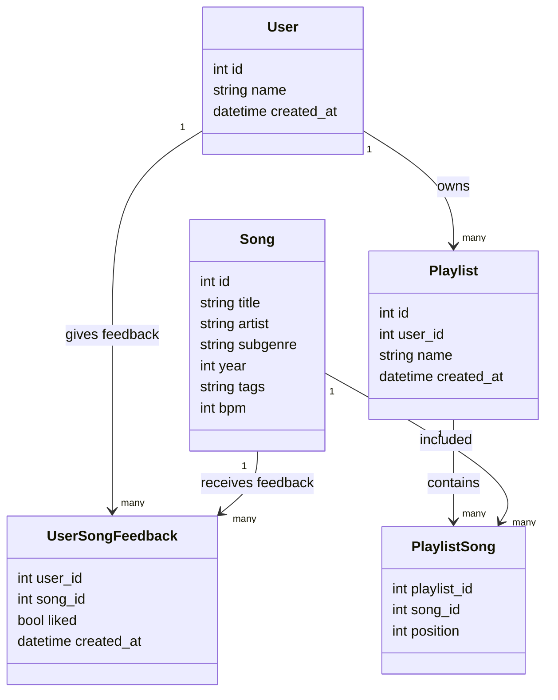
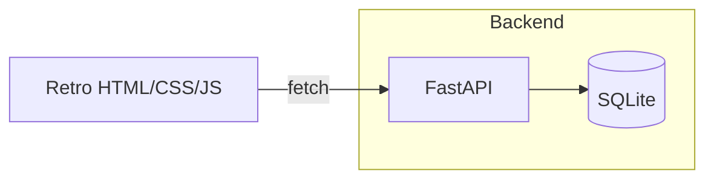

# TASK-000 — Music Playlist Generator (House Edition, v1)

**Goal:** Build a minimal but complete software application that will later be used for DevOps pipeline design.  
**Theme:** Retro/pixely “dot‑com era” UI.  
**Use Case:** A *music playlist generator* that creates playlists from a user’s taste profile gathered via a like/dislike quiz.

---

## 0) TL;DR (Quick Start for Windsurf)

- **Stack**: FastAPI (Python) + SQLite + vanilla HTML/CSS (retro 90s web vibe) + minimal JS.
- **Core features (meets 2+ requirement):**
  1. **Taste quiz**: record user like/dislike for random songs → build a “taste profile”.
  2. **Playlist generation**: user chooses length + (optional) genre or seed song → generate playlist.
  3. **Save playlist**: persist to user profile (CRUD for playlists).
- **Persistent storage**: SQLite (seeded with **≥ 50 real house tracks**).
- **API-first** with minimal retro UI consuming the API.
- **Docs**: SDLC section, Mermaid UML/architecture diagrams, README instructions.
- **Git**: individual repo, at least 3 meaningful commits.
- **Deliverables**: working code + short 5–6 page report.

> ✅ Build v1 focused on a single genre (“House & subgenres”), then generalize later.

---

## 1) Scope & Non‑Goals

### In‑Scope
- Create users (by name), run taste quiz (like/dislike), generate and save playlists.
- Local SQLite DB; seed with ≥ 50 **real** house songs (titles/artists) for content‑based recommendations.
- Retro/pixely UI with basic forms/pages (no framework; fine to use a tiny CSS file).
- RESTful API endpoints powering the UI.

### Non‑Goals (v1)
- No auth/passwords/OAuth (user is identified by name only).
- No streaming, lyrics, or external APIs.
- No multi‑genre seed in v1 DB (house‑only to reduce complexity).
- No advanced ML—use a simple, explainable scoring heuristic.

---

## 2) Recommended Tech Stack

- **Backend:** Python **FastAPI** (lightweight, async, excellent docs), Uvicorn for dev server.
- **DB:** **SQLite** via **SQLModel** or SQLAlchemy ORM; alembic optional for future migrations.
- **Frontend:** HTML + CSS (retro) + tiny JS (fetch API). *Optional*: HTMX for progressive enhancement.
- **Dev tooling:** `uv` or `pip` + `venv`, `black` + `ruff` (lint/format), `pytest`.
- **Why this stack:**
  - Minimal setup, great DX, fast iteration.
  - Easy to containerize later for DevOps pipelines.
  - SQLite is perfect for local persistent storage and seeding.

> Alt: Node.js/Express + SQLite3 is viable, but Python suits the student’s current strengths.

---

## 3) Data Model (Entities & Relationships)

### Tables
- **users**: `id`, `name` (unique), `created_at`
- **songs**: `id`, `title`, `artist`, `subgenre`, `year`, `tags` (CSV), `bpm` (int, optional)
- **user_song_feedback**: `user_id`, `song_id`, `liked` (bool), `created_at`
- **playlists**: `id`, `user_id`, `name`, `created_at`
- **playlist_songs**: `playlist_id`, `song_id`, `position`

#### Mermaid Class Diagram


---

## 4) Features & Acceptance Criteria

### F1 — Create user “account” by name
- **UI**: form with a text box (“Your name”) → creates/loads user.
- **API**: `POST /api/users` with `{name}`; idempotent (returns existing if found).
- **Persist**: row in `users` table.
- **Done when**: submitting name shows “Welcome, <name>” and a link/button to start quiz.
- **Edge cases**: empty name → validation error; duplicate names prevented/returned.

### F2 — Taste quiz (like/dislike on random songs)
- **UI**: shows song title + artist; buttons: 👍 Like / 👎 Dislike / ⏭️ Skip.
- **API**: 
  - `POST /api/quiz/start` → returns `n` random song IDs (default 10).
  - `POST /api/quiz/answer` `{song_id, liked}` → stores in `user_song_feedback`.
- **Done when**: at least 10 answers recorded (like/dislike/skip).

### F3 — Generate playlist based on taste profile
- **UI**: form with **count** (e.g., 20), optional **genre/subgenre**, or **seed song** (search box).
- **API**: `POST /api/playlists/generate` with `{user_id, count, genre?, seed_song_id?}` → returns ordered candidate list (not yet saved).
- **Done when**: playlist previews in UI with “Save playlist” button.

### F4 — Save playlist to profile (CRUD minimalism)
- **UI**: “Save” asks for a playlist name (default “<name> - <date>”) → shows in “Your Playlists” list.
- **API**: `POST /api/playlists` `{user_id, name, song_ids[]}` → persists rows in `playlists` and `playlist_songs` with `position`.
- **Done when**: saved playlist appears; **Delete** action removes it.
- **Nice‑to‑have**: GET `/api/playlists?user_id=…` and `/api/playlists/{id}`; `DELETE /api/playlists/{id}`.

> **Grading mapping:** F1 + F3 satisfy the two required features (50%). F4 and the overall quality target the extra 10%.

---

## 5) Recommendation Algorithm (v1: simple, explainable)

**Input sources**
- User likes/dislikes from quiz.
- Optional seed song.
- Optional selected subgenre.

**Signals (weights in parentheses):**
- **Artist affinity**: +2 if artist was liked; −2 if disliked.
- **Subgenre affinity**: +1 if liked; −1 if disliked.
- **Tag overlap**: +0.5 per shared tag (e.g., “vocal”, “piano”, “french-house”, “deep”).
- **BPM proximity**: +0.3 if within ±8 BPM of median liked BPM (skip if BPM unknown).
- **Era proximity**: +0.2 if within ±5 years of median liked year.
- **Seed song similarity** (if provided): +1 per match (artist, subgenre, tags), +0.3 if BPM close.

**Score formula (example):**
```
score(song) = 2*artistLiked - 2*artistDisliked
              + 1*subgenreLiked - 1*subgenreDisliked
              + 0.5*tagOverlapCount
              + 0.3*bpmNear + 0.2*eraNear
              + seedSimilarity
              + ε (small jitter to avoid ties)
```
Return top *N* not already downvoted by the user.

> This is intentionally simple & auditable for the course; easy to unit‑test and later replace with a more advanced model.

---

## 6) API Design (Minimal)

- `POST /api/users` → create or get user by name → `{id, name}`
- `POST /api/quiz/start` → `{user_id, n?}` → returns `songs[]`
- `POST /api/quiz/answer` → `{user_id, song_id, liked}` → `204`
- `GET  /api/songs` → queryable list: `?q=&subgenre=&limit=&offset=`
- `POST /api/playlists/generate` → `{user_id, count, genre?, seed_song_id?}` → `songs[]`
- `POST /api/playlists` → `{user_id, name, song_ids[]}` → `{playlist_id}`
- `GET  /api/playlists?user_id=...` → `[{id, name, count, created_at}]`
- `GET  /api/playlists/{id}` → `{id, name, user_id, songs: [{song, position}]}`
- `DELETE /api/playlists/{id}` → `204`

**Validation**
- All IDs must exist; `count` in [5, 100]. 400 on bad input.

---

## 7) UI Spec (Retro “dot‑com era”)

- **Look & feel**: low‑fi, pixel fonts, bright accents, beveled buttons, simple table layouts.
- **Pages**
  1. **Home**: enter name → “Start quiz”
  2. **Quiz**: show song (Title — Artist) + buttons 👍 👎 ⏭️
  3. **Generate**: choose count + optional subgenre/seed song → preview results
  4. **Profile**: list saved playlists (view/delete)
- **Accessibility**: keyboard‑navigable buttons; sufficient contrast.
- **Assets**: single `retro.css` with pixel font (e.g., *Press Start 2P* or system bitmap alternative).

---

## 8) Seed Data (House‑only v1)

- File: `seed/house_seed.csv`  
  Columns: `title,artist,subgenre,year,tags,bpm` (bpm optional; blank allowed).  
- Must contain **≥ 50** real tracks. Suggested starter list below (edit as needed):

| # | Title | Artist | Subgenre | Year | Tags | BPM |
|---|-------|--------|----------|------|------|-----|
|1|One More Time|Daft Punk|french-house|2000|anthem,filter,classic|123|
|2|Around the World|Daft Punk|french-house|1997|loop,filter,classic|121|
|3|Music Sounds Better With You|Stardust|french-house|1998|filter,classic|124|
|4|Show Me Love|Robin S.|house|1993|vocal,piano,classic|124|
|5|Ride on Time|Black Box|italo-house|1989|vocal,piano|118|
|6|Good Life|Inner City|techno-house|1988|vocal,classic|122|
|7|Gypsy Woman (She's Homeless)|Crystal Waters|house|1991|vocal,organ|124|
|8|Finally|CeCe Peniston|house|1991|vocal,classic|120|
|9|Move Your Body|Marshall Jefferson|chicago-house|1986|piano,classic|122|
|10|Your Love|Frankie Knuckles & Jamie Principle|chicago-house|1987|classic|120|
|11|Promised Land|Joe Smooth|chicago-house|1987|classic,vocal|122|
|12|Can You Feel It|Mr. Fingers|deep-house|1986|classic,deep|122|
|13|You Don't Know Me|Armand Van Helden ft. Duane Harden|house|1999|vocal,classic|124|
|14|Lady (Hear Me Tonight)|Modjo|french-house|2000|vocal,guitar|120|
|15|Groovejet (If This Ain't Love)|Spiller ft. Sophie Ellis-Bextor|house|2000|vocal,disco|124|
|16|The Bomb! (These Sounds Fall Into My Mind)|The Bucketheads|disco-house|1995|sample,disco|128|
|17|1999|Cassius|french-house|1999|filter,classic|125|
|18|Big Love|Pete Heller|house|1998|vocal,anthem|126|
|19|Needin' U|David Morales presents The Face|house|1998|vocal,anthem|126|
|20|Another Chance|Roger Sanchez|house|2001|vocal,melodic|126|
|21|The Weekend|Michael Gray|house|2004|vocal,disco|126|
|22|Stupidisco|Junior Jack|house|2004|vocal,club|126|
|23|Lola's Theme|The Shapeshifters|disco-house|2004|vocal,strings|128|
|24|Feel the Vibe ('Til the Morning Comes)|Axwell|progressive-house|2004|anthem|128|
|25|Call on Me|Eric Prydz|progressive-house|2004|sample,anthem|126|
|26|Satisfaction|Benny Benassi|electro-house|2002|electro,anthem|126|
|27|World, Hold On|Bob Sinclar|house|2006|vocal,anthem|128|
|28|Love Generation|Bob Sinclar|house|2005|vocal,whistle|128|
|29|Hello|Martin Solveig & Dragonette|electro-house|2010|vocal|128|
|30|I Got U|Duke Dumont ft. Jax Jones|deep-house|2014|tropical,vocal|120|
|31|Latch|Disclosure ft. Sam Smith|house/garage|2012|vocal,uk|122|
|32|Ready For Your Love|Gorgon City ft. MNEK|deep-house|2014|vocal,uk|122|
|33|17|MK|house|2017|vocal|124|
|34|Piece of Me|MK ft. Becky Hill|house|2016|vocal|124|
|35|My Love|Route 94 ft. Jess Glynne|deep-house|2014|vocal,uk|120|
|36|Look Right Through (MK Remix)|Storm Queen|house|2010|vocal|124|
|37|Cola|CamelPhat & Elderbrook|tech-house|2017|vocal|124|
|38|Piece Of Your Heart|Meduza ft. Goodboys|house|2019|vocal|124|
|39|Lose Control|Meduza, Becky Hill & Goodboys|house|2019|vocal|124|
|40|Losing It|Fisher|tech-house|2018|club|125|
|41|Feel My Needs|Weiss|house|2018|vocal|124|
|42|Hypnotized|Purple Disco Machine & Sophie and the Giants|disco-house|2020|vocal,disco|114|
|43|Deep End|John Summit|tech-house|2020|club|125|
|44|One Night|Sonny Fodera & MK|house|2019|vocal|124|
|45|No Eyes|Claptone ft. Jaw|deep-house|2013|vocal|120|
|46|Deceiver|Chris Lake & Green Velvet|tech-house|2019|club|126|
|47|Turn off the Lights|Chris Lake|house|2018|club|126|
|48|Love Tonight|Shouse|house|2017|vocal,choir|126|
|49|One (Your Name)|Swedish House Mafia|progressive-house|2010|anthem|128|
|50|Levels|Avicii|progressive-house|2011|anthem|126|

> Feel free to tweak BPM/years if you validate them; they are *not required* for v1 scoring.

---

## 9) Architecture Overview



- **Why this architecture:** very small surface area, deterministic environment, easy to dockerize later.

---

## 10) Repository Layout

```
playlist-gen/
├─ app/
│  ├─ main.py              # FastAPI app, routes
│  ├─ models.py            # SQLModel/SQLAlchemy models
│  ├─ schemas.py           # Pydantic schemas
│  ├─ services/
│  │  └─ recommender.py    # scoring / playlist generation
│  ├─ db.py                # session, init, seed
│  ├─ routers/             # modular endpoints
│  │  ├─ users.py
│  │  ├─ songs.py
│  │  ├─ quiz.py
│  │  └─ playlists.py
│  ├─ static/
│  │  ├─ retro.css
│  │  └─ pixel-fonts/
│  └─ templates/           # Jinja2 or plain HTML files
├─ seed/
│  └─ house_seed.csv
├─ tests/
│  ├─ test_api.py
│  ├─ test_recommender.py
│  └─ test_models.py
├─ README.md
├─ requirements.txt
├─ .env.example
├─ .gitignore
└─ report/                 # 5–6 page short report
   ├─ report.md
   └─ diagrams/            # exported images of Mermaid if needed
```

---

## 11) SDLC Model & Documentation

### Chosen Model: **Iterative/Incremental** (lightweight Agile)
- **Justification**: small scope; feedback loops matter (quiz → recommendations), easy to evolve DB (house → multi‑genre), straightforward to add CI/CD later.
- **Phases (deliverables to include in report):**
  1. **Planning**: scope, stakeholders (student, instructor), constraints (no external APIs), risks (seed quality), timeline.
  2. **Requirements**: functional (F1–F4), non‑functional (performance > instant for N≤100, clarity, accessibility), data retention.
  3. **Design**: data model, architecture diagram, API spec, UI wireframes.
  4. **Implementation**: code following repo layout; unit tests.
  5. **Verification**: run tests, manual QA with checklists.
  6. **Release**: tag v1.0.0, freeze report.
  7. **(Prep for DevOps)**: containerization plan, CI hooks.

Include these in the **short report** with diagrams (Mermaid export ok).

---

## 12) Testing Strategy

- **Unit tests**
  - `recommender.score(song)` deterministic given fixed feedback
  - playlist generation returns **exact count** and **no duplicates**
  - excludes songs the user disliked
- **API tests**
  - user creation idempotency
  - quiz endpoints store feedback
  - playlist CRUD happy path & error cases
- **Seed tests**
  - CSV has ≥ 50 rows, required columns present
  - all titles/artists are non‑empty

---

## 13) Version Control Plan (meets rubric)

- **Repo**: individual GitHub repo.
- **Branching**: `main` + feature branches.
- **Min 3 meaningful commits** (examples):
  1. `feat(api): scaffold FastAPI app, models, SQLite init`  
  2. `feat(recommender): implement v1 scoring + playlist generation`  
  3. `feat(ui): add retro HTML/CSS, quiz & playlist flows`  
  4. `test: add unit & API tests; seed ≥50 songs`  
  5. `docs: README, SDLC write‑up, diagrams`

Use descriptive messages following conventional commits if possible.

---

## 14) README Outline (to implement in repo)

- Project overview & features
- Tech stack
- Getting started
  - `python -m venv .venv && source .venv/bin/activate`
  - `pip install -r requirements.txt`
  - `uvicorn app.main:app --reload`
  - visit `http://localhost:8000`
- Seeding the DB from `seed/house_seed.csv`
- API endpoints (with curl examples)
- Running tests: `pytest -q`
- Known limitations
- License

---

## 15) DevOps/Scalability Reflection (for report)

- **Containerization**: Dockerfile + multi‑stage build; `uvicorn` behind `gunicorn` for prod.
- **CI**: GitHub Actions → lint (`ruff`), format (`black --check`), tests, build artifact.
- **CD**: deploy to a small VM or PaaS; migrate DB automatically.
- **Config**: `.env` for DB URL, app secret (even if not used yet).
- **Observability**: FastAPI logging + request metrics (later with Prometheus).
- **Data growth**: move from SQLite → Postgres; normalize artists/genres; add indices.
- **Recommendation evolution**: store embeddings or train a simple collaborative filter.

---

## 16) Task Breakdown (for Windsurf)

### Milestone A — Skeleton & DB (Day 1)
- [ ] Scaffold FastAPI project & routes
- [ ] Define models (users, songs, user_song_feedback, playlists, playlist_songs)
- [ ] Write DB init & seed loader for `seed/house_seed.csv`
- [ ] Add `/api/users`, `/api/songs` basic endpoints
- **Acceptance**: app runs; swagger at `/docs`; songs list returns ≥ 50.

### Milestone B — Quiz & Feedback (Day 2)
- [ ] `POST /api/quiz/start` (random N songs)
- [ ] `POST /api/quiz/answer` (store like/dislike/skip)
- [ ] Minimal UI screens for name capture + quiz
- **Acceptance**: 10 answers produce stored feedback rows.

### Milestone C — Recommender & Playlist (Day 3)
- [ ] Implement scoring heuristic & generator
- [ ] `POST /api/playlists/generate`
- [ ] UI to request count/genre/seed; preview playlist
- **Acceptance**: playlist of chosen size; excludes disliked songs.

### Milestone D — Save & Manage (Day 4)
- [ ] `POST /api/playlists` save
- [ ] `GET /api/playlists?user_id=...`, `GET /api/playlists/{id}`
- [ ] `DELETE /api/playlists/{id}`
- [ ] UI for viewing/deleting saved playlists
- **Acceptance**: playlist persists and is visible in profile.

### Milestone E — Polish & Docs (Day 5)
- [ ] Retro CSS polish; keyboard shortcuts
- [ ] README + diagrams + short report draft
- [ ] Tests green; format/lint clean
- **Acceptance**: demo end‑to‑end; report 5–6 pages ready.

---

## 17) Rubric Mapping (How we’ll score well)

- **Features 60%**: F1–F4 cover two required features with quality; optional polish for extra 10%.
- **Docs & Report 20%**: SDLC justification + diagrams + README complete.
- **Code & Git 20%**: clean modules, comments, tests; ≥ 3 meaningful commits.

---

## 18) Definition of Done (DoD)

- All acceptance criteria pass for F1–F4.
- DB seeded with **≥ 50** house tracks.
- Tests pass locally; lint/format clean.
- README lets another student run the project without help.
- Short report includes SDLC model, architecture diagram, and DevOps reflection.

---

## 19) Nice‑to‑Haves (post‑v1, if time allows)

- Song search autocomplete for seed selection.
- Tag editor to enrich songs.
- Export playlist as `.m3u`.
- Dockerfile + GitHub Actions CI.
- Expand DB to multi‑genre (populating `genre` dimension and filtering logic).

---

**End of TASK-000. Ship it.**

