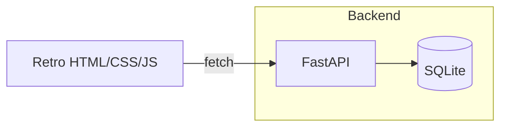
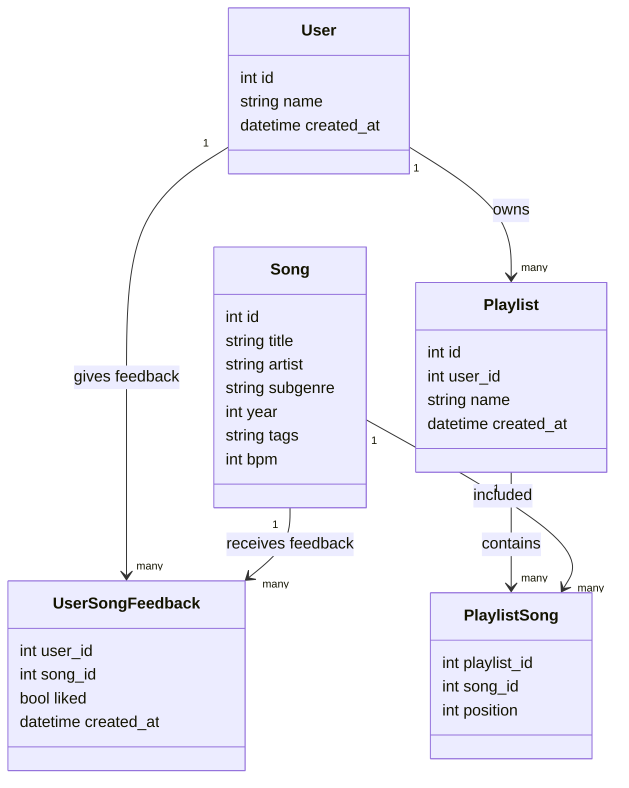

# PlayLister - House Music Playlist Generator Report

## 1. Project Overview

PlayLister is a retro-themed music playlist generator that creates personalized playlists based on user preferences. The application focuses on house music and its subgenres, providing a nostalgic 90s web interface with modern backend functionality.

## 2. Software Development Life Cycle (SDLC)

### 2.1 Chosen Model: Iterative/Incremental (Lightweight Agile)

The development of PlayLister followed an iterative and incremental approach, allowing for rapid prototyping and feature delivery. This model was selected for several reasons:

- **Small, well-defined scope**: The project requirements were clear from the beginning
- **Feedback loops matter**: The recommendation system benefits from iterative improvements
- **Easy database evolution**: The schema can be expanded from house music to multi-genre
- **Straightforward future CI/CD integration**: Containerization and deployment pipelines can be added later

### 2.2 SDLC Phases

#### Planning
- **Scope**: House music playlist generator with taste quiz and recommendation algorithm
- **Stakeholders**: End users, developers, course instructors
- **Constraints**: No external APIs or streaming capabilities in v1
- **Risks**: Quality of seed data, recommendation algorithm effectiveness
- **Timeline**: One week for development and delivery

#### Requirements Analysis
- **Functional Requirements**:
  - User creation by name (F1)
  - Taste quiz for like/dislike gathering (F2)
  - Playlist generation from taste profile (F3)
  - Playlist saving and management (F4)
- **Non-functional Requirements**:
  - Performance: Recommendations generated in under 1 second
  - UI: Retro 90s style interface
  - Accessibility: Keyboard navigation support
  - Data Retention: Local storage of user preferences

#### Design
- **Data Model**: SQLite with five primary tables (users, songs, feedbacks, playlists, playlist_songs)
- **Architecture**: FastAPI backend with HTML/CSS/JS frontend
- **API Design**: RESTful endpoints for all user interactions
- **UI Design**: Pixel font, beveled buttons, retro color scheme

#### Implementation
- **Backend**: Python with FastAPI framework
- **Database**: SQLite with SQLModel ORM
- **Frontend**: HTML templates with vanilla JavaScript
- **Styling**: Custom retro.css with 90s aesthetics

#### Testing
- **Unit Testing**: Recommendation algorithm, user creation
- **API Testing**: Endpoint validation and response formatting
- **Manual Testing**: UI interaction and playlist generation

#### Deployment
- **Local Deployment**: Uvicorn ASGI server
- **Documentation**: README with setup instructions
- **Version Control**: Git with semantic commits

## 3. Architecture Diagram

## 4. Data Model

The application uses the following database schema:

## 5. Recommendation Algorithm

The playlist generator implements a content-based filtering approach with the following scoring components:

- **Artist affinity**: +2 if artist was liked; −2 if disliked
- **Subgenre affinity**: +1 if liked; −1 if disliked
- **Tag overlap**: +0.5 per shared tag (e.g., "vocal", "piano", "deep-house")
- **BPM proximity**: +0.3 if within ±8 BPM of median liked BPM
- **Era proximity**: +0.2 if within ±5 years of median liked year
- **Seed song similarity**: +1 per match (artist, subgenre, tags), +0.3 if BPM close

The algorithm excludes all songs the user has previously disliked and applies a small random jitter to avoid ties.

## 6. DevOps Considerations

For future expansion of the project, the following DevOps practices would be implemented:

- **Containerization**: Docker for consistent deployment environments
- **CI/CD**: GitHub Actions workflow for testing and deployment
- **Configuration Management**: Environment variables for all configurable parameters
- **Database Migration**: Alembic for schema changes as features expand
- **Monitoring**: FastAPI built-in request logging and performance metrics
- **Scaling**: Transition from SQLite to PostgreSQL for multi-user scenarios
